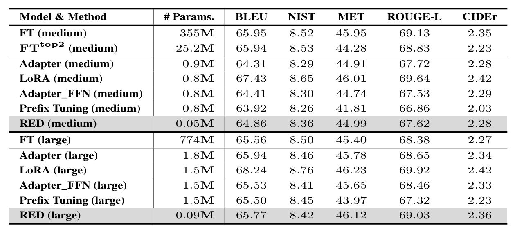

# Introduction

This directory contains the scrpits for training and evaluation of RED on GPT-2 medium and GPT-2 large, the results are shown as follows:




# Evaluation

- Evaluate based on the GPT-2 large generation results we have provided

  ```bash
  cd Test
  bash gpt2_large_evaluation.sh
  ```


- Evaluation scripts:

  ```bash
  cd ../../../../e2e-metrics
  
  ./measure_scores.py ../model/GPT-2/gpt2_large/generation/label.txt \
                      ../model/GPT-2/gpt2_large/generation/pred.txt \
  ```

  - `../model/GPT-2/gpt2_large/generation/label.txt` denotes the path of the reference and `../model/GPT-2/gpt2_large/generation/pred.txt` denotes the path of the model outputs


- Use the model we have provided and specify the decoding strategy to generate samples and save them in the `pred.txt file`

  ```bash
  cd ../../../../
  CUDA_VISIBLE_DEVICES=0 python ./RED/GPT-2/gpt2_large.py \
      --do_test \
      --load_path ./model/GPT-2/gpt2_large/checkpoint/delta_vector.pth \
      --model_type "gpt2-large" \
  ```

  - `--load_path` denotes the path of editing vectors
  - When decoding is completed, the output result of the model will be saved in folder `RED/Results/RED/gpt2-large/generation`


# Training

1. Training and decoding by executing this script:

   ```bash
   # Training on GPT2-medium
   cd GPT2-medium
   bash e2e.sh
   ```

   

- Training script:

  ```bash
  seeds=(42 43 44)
  for seed in ${seeds[@]}
  do
  CUDA_VISIBLE_DEVICES=2 python ../../../../RED/GPT-2/gpt2_medium.py \
      --seed $seed \
      --weight_decay 0.0001 \
      --lr 0.06 \
      --do_train \
      --do_eval \
      --do_test \
      --label_smooth 0.0 \
      --warmup_step 500 \
      --model_type "gpt2-medium" \
      --batch_size 10 \
      --epochs 5
  done
  ```

  - When Training is completed, the checkpint and output result of the model will be saved in folder `RED/Results/RED/gpt2-medium/save_models` and `RED/Results/RED/gpt2-medium/generation` respectively


2. Evaluate the result

   ```bash
   cd ../../../../e2e-metrics
   
   ./measure_scores.py ['label_path'] \
                       ['pred_path'] \
   ```

   - When the previous stage of training is completed, folder `RED/Results/RED/gpt2-medium/generation`  will store `label` and `pred`. 
   - Passing the corresponding path, and the tesing of the model can be completed

