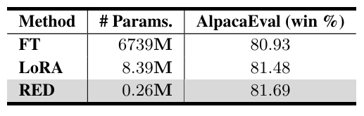
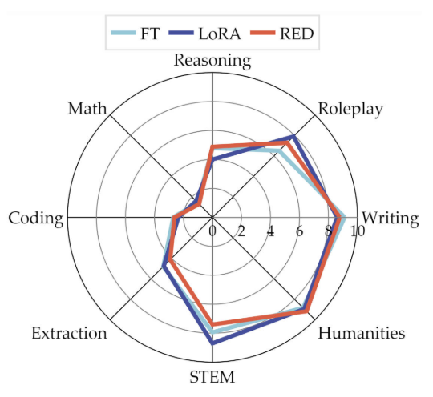

# Introduction

This directory contains the scrpits for training and evaluation of RED on Llama2-7B, the results are shown as follows:

- Alpaca-Eval:

  

- MT-Bench:

  


# Evaluation

- We have provided the Llama2-7B generation results at `model/Llama/generation/alpaca_eval_RED.json`, and you can directly pass the generated results to calculate the win rate of RED on Alpaca-Eval, please see [Alpaca-Eval](https://github.com/tatsu-lab/alpaca_eval).


- You can also generate the response by executing this script:

  ```bash
  bash generate_alpaca_eval.sh
  ```

  

- Generation scripts:

  ```bash
  CUDA_VISIBLE_DEVICES=0 python ../../../RED/Llama/generate_alpaca_eval.py   \
      --model_path "meta-llama/Llama-2-7b-hf"  \
      --save_path "../../../Results/RED/Llama/geneartion" \
      --peft "RED" \
      --peft_path "../../../model/Llama/delta_vector.pth" \
      --is_train_return False \
      --no_repeat_ngram_size 5 \
      --repetition_penalty 1.1
  ```

  - `--model_path` denotes the path of Pre-trained Llama2-7B
  - `--peft_path` denotes the path of editing vectors 


- We have also provided the checkpoint of editing vectors at `model/Llama/checkpoint`, and we use [lm-evaluation-harness](https://github.com/EleutherAI/lm-evaluation-harness) for open llm Evaluation and [FastChat](https://github.com/lm-sys/FastChat) for MT-Bench evaluation.

  ```bash
  cd ../../../lm-evaluation-harness
  pip install -e .
  bash bash/run.sh
  ```


# Training

- Training by executing this script:

  ```
  bash train.sh
  ```

  

- Training script:

  ```bash
  CUDA_VISIBLE_DEVICES=0 python ../../../RED/Llama/llama.py   \
      --model_path "meta-llama/Llama-2-7b-hf" \
      --data_path  "HuggingFaceH4/ultrafeedback_binarized" \
      --output_dir "../../../Results/RED/Llama/" \
      --learning_rate 2e-5
  ```

  - `--model_path` denotes the path of Pre-trained Llama2-7B
  - `--output_dir` denotes the path for saving editing vectors


- We conduct evaluation after training every training epoch and select the model with the best performance on TruthfulQA for final testing. And we conduct this evaluation by using [lm-evaluation-harness](https://github.com/EleutherAI/lm-evaluation-harness).
