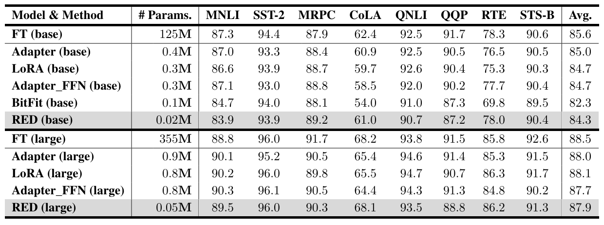
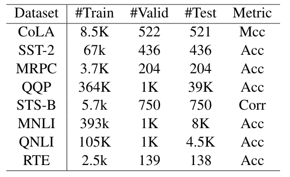

# Introduction

This directory contains the scrpits for training and evaluation of RED on RoBERTa-base and RoBERTa-large, the results are shown as follows:




# Evaluation

- Evaluate RED on RoBERTa-base 

  ```bash
  cd Test/RoBERTa-base
  bash run.sh
  ```


- Evaluation scripts (MNLI):

  ```bash
  cd ../../../../../
  CUDA_VISIBLE_DEVICES=0 python ./RED/RoBERTa/roberta_base.py \
      --dataset_name "mnli" \
      --do_test \
      --load_path ./model/RoBERTa/RoBERTa_base/checkpoint/mnli \
    --model_type "roberta_base" \
  ```
  
  - `--load_path` denotes the path to load  editing vectors


We have provided checkpoints trained on three datasets, MNLI, QNLI, and QQP, for quick evaluation. However, the validation set of other datasets is small and is more affected by different random seeds when dividing the validation set and test set. Therefore, we recommend users to use the provided scripts for training and validation. The data split results are as follows:




# Training

1. Training and evaluating on RoBERTa-base

   ```bash
   cd RoBERTa-base
   bash run.sh
   ```
   


- Training script of STSB.sh:

  ```bash
  seeds=(42 43 44 45 46)
  for seed in ${seeds[@]}
  do
  CUDA_VISIBLE_DEVICES=0 python ../../../../RED/RoBERTa/roberta_base.py \
      --seed $seed \
      --weight_decay 0.0 \
      --dataset_name "stsb" \
      --batch_size 32 \
      --lr 0.003 \
      --do_train \
      --do_eval \
      --do_test \
      --warmup_rate 0.06 \
      --operation_key "ffn_all_layer" \
      --model_type "roberta_base" \
      --epochs 40
  done
  ```


1. For almost all tasks, we conducted experiments on five different random seeds and calculated the average value as the final result. 
2. For tasks such as CoLA and RTE, some random seeds may cause training collapse (whether our RED method, other PEFT methods, or even FT, refer to the link [Issue](https://github.com/microsoft/LoRA/issues)) , as we also mentioned in the Appendix A section. Therefore, in order to achieve fair and effective comparison, we selected 15 random seeds for all baselines on both tasks (CoLA and RTE) and calculated the average of the highest 5 results.

